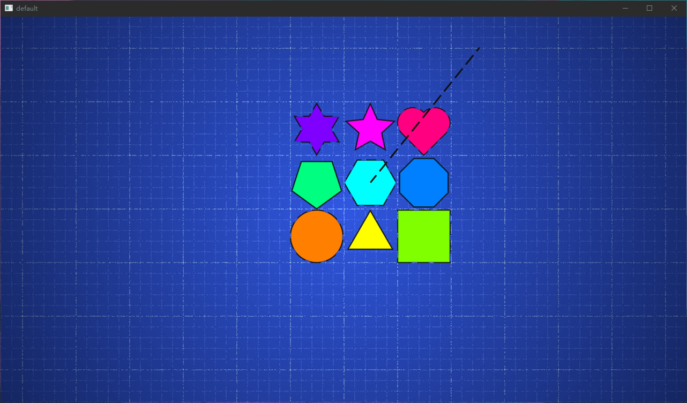

# yam

`yam` is a `game library` which uses ECS(Entity-Component-System) architecture dedicated to running millions of units.

## The State

`yam` is in the early stages of development, feature-less, documentation-sparse and change-quick. You can try to play with it, run the examples to know the basic information of `yam`.

**Any suggestions or questions are welcome**.

## Libraries Used

* [legion](https://github.com/amethyst/legion): easy to use, feature-rich and high-performance ECS library.
* [nalgebra](https://github.com/dimforge/nalgebra): amazing, powerful and high-performance algebra library.
* [wgpu-rs](https://github.com/gfx-rs/wgpu-rs): low-level, cross-platform and modern graphics library.
* [winit](https://github.com/rust-windowing/winit): cross-platform window creation and management in Rust.

## Roadmap

* A simple `AssetLoader` to load texture, shader and scripts.
* A debug graph primitive which can draw a line, a circle in limited sytle.
* Embed a simple `IMGUI` module.
* Embed a simple `Script` module
* More flexible render pipeline, get data from shader by reflecting.

## The Example

1. **app**: Show the basic architecture of `yam`.

    ```bash
    cargo run --example app
    ```

2. **input**: Show how to iterat with the mouse and keyboard.

    ```bash
    cargo run --example input
    ```

3. **time**: Show how to get the accurate time consuming of the last frame.

    ```bash
    cargo run --example time
    ```

4. **window**: Show how to get or modify the properties of window.

    ```bash
    cargo run --example window
    ```

5. ~~**sprite**: Show how to render a sprite to screen.~~(WAITTING TO FIX)

    ```bash
    cargo run --example sprite
    ```

    

6. **geometry**: Show how to render a geometry to screen.

    ```bash
    cargo run --example geometry
    ```

7. ~~**millions_sprites**: Show how to render millions of sprites to screen in 60fps.~~(WAITTING TO FIX)

    ```bash
    # Use `--release` flag to prevent performance decline.
    cargo run --example millions_sprites --release
    ```

8. **millions_geometry**: Show how to render millions of geometries to screen in 60fps.

    ```bash
    # Use `--release` flag to prevent performance decline.
    cargo run --example millions_geometry --release
    ```

9. (TODO)**render2d_millions_with_simd**: Show how to optimize **render2d_millions** by SIMD.

    ```bash
    # Use `--release` flag to prevent performance decline.
    cargo run --example render2d_millions_with_simd --release
    ```
